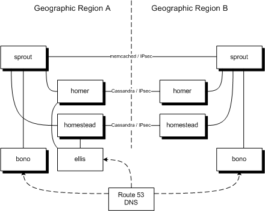

Geographic redundancy
=====================

This article describes

-   the architecture of a geographically-redundant system
-   the (current) limitations
-   the probable impact on a subscriber of a failure
-   how to set it up.

Architecture
------------

The architecture of a geographically-redundant system is as follows.

Sprout is a single cluster split over the geographic regions.
memcached does not support the concept of local and remote peers, so
this is the best we can do at present. Communication between the nodes
is encrypted and authenticated with IPsec. Each sprout uses homers and
homesteads in the same region only.

Separate instances of bono in each geographic region front the sprouts
in that region.  Clearwater uses a geo-routing DNS service such as
Amazon's Route&nbsp;53 to achieve this.A geo-routing DNS service
responds to DNS queries based on latency, so if you're nearer to
geographic region B's instances, you'll be served by them.

Homestead and homer are each a single cluster split over the
geographic regions. Since they are backed by Cassandra (which is aware
of local and remote peers), they can be smarter about spatial
locality. Communication between the nodes is encrypted and
authenticated with IPsec. (Cassandra also supports TLS
authentication/encryption but since we already have IKE/IPsec
configured for other nodes, it is simpler to use this.)

ellis is not redundant, whether deployed in a single geographic region
or more. It is deployed in one of the geographic regions and a failure
of that region would deny all provisioning function.

While it appears as a single node in our system, Route 53 DNS is actually a
geographically-redundant service provided by Amazon. Route 53's DNS
interface has had 100% uptime since it was first turned up in 2010.
(Its configuration interface has not, but that is less important.)

The architecture above is for 2 geographic regions but could equally be
extended to more.

Note that there are other servers involved in a deployment that are not
described above. Specifically,

-   communication back to the repository server is via HTTP. There is a
    single repository server. The repository server is not required in
    normal operation, only for upgrades.
-   splunk, mmonit, and cacti communications are not secured, so they must be
    deployed in each region (meaning that administrators see 2 mmonits
    and 2 splunks).

Limitations
-----------

-   It's not possible to build a geographically-redundant deployment
    automatically with chef. The basic servers can be set up
    automatically but there is still some manual orchestration after
    this.
-   We use a single per-repository certificate for authenticating our
    secure connections. It would be more secure to use individual,
    per-region or per-deployment certificates but this would make
    orchestration more complicated. When orchestration is done via chef
    (and hence automatic), this would be worth further consideration.
-   Communication with splunk and mmonit are not secured, so they must
    be deployed in each region. We could enable IPsec for these
    connections too and have centralized instances.
-   memcached is not aware of the concept of local and remote peers, so
    often stores local subscriber registration information in a remote
    geographic region. This is a restriction of memcached.

Impact
------

This section considers the probable impact on a subscriber of a total
outage of a region in a 2-region geographically-redundant deployment. It
assumes that the deployments in both regions have sufficient capacity to
cope with all subscribers (or the deployments scale elastically) - if
this is not true, we will hit overload scenarios, which are much more
complicated.

The subscriber interacts with Clearwater through 3 interfaces, and these
each have a different user experience.

-   SIP to bono for calls
-   HTTP to homer for direct call service configuration (not currently
    exposed)
-   HTTP to ellis for web-UI-based provisioning

For the purposes of the following descriptions, we label the two regions
A and B, and the deployment in region A has failed.

### SIP to bono

If the subscriber was connected to a bono node in region A, their TCP
connection fails. They then attempt to re-register. If it has been more
than the DNS TTL (proposed to be 30s) since they last connected, DNS
will point to region B, they will re-register and their service will
recover (both for incoming and outgoing calls). If it has been less than
the DNS TTL since they last connected, they will probably wait 5 minutes
before they try to re-register (using the correct DNS entry this time).

If the subscriber was connected to a bono node in region B, their TCP
connection does not fail and they do not re-register. However, they have
a 50% chance that their registration was stored in region A, in which
case their incoming calls will fail until they re-register. By default,
we propose re-registering every 5 minutes, so on average the subscriber
would be without incoming service for 2.5 minutes.

Overall, the subscriber's expected outgoing call service outage would be
as follows.

      50% chance of being on a bono node in region A *
      30s/300s chance of having a stale DNS entry *
      300s re-registration time
    = 5% chance of a 300s outage
    = 15s average outage

Likewise, a subscriber's expected incoming call service outage would be
as follows.

      ( 50% chance of being on a bono node in region A *
        30s/300s chance of having a stale DNS entry *
        300s re-registration time ) +
      ( 50% chance of being on a bono node in region B *
        50% chance of having registration stored in region A *
        50% average amount through the registration period when the failure occurred *
        300s re-registration time )
    = 5% chance of a 300s outage + 25% chance of a 150s outage
    = 52.5s average outage

Realistically, if 50% of subscribers all re-registered almost
simultaneously (due to their TCP connection dropping and their DNS being
timed out), it's unlikely that bono would be able to keep up.

Also, depending on the failure mode of the nodes in region A, it's
possible that the TCP connection failure would be silent and the clients
would not notice until they next re-REGISTERed. In this case, all
clients connected to bonos in region A would take an average of 150s to
notice the failure. This equates to a 75% chance of a 150s outage, or an
average outage of 112.5s.

### HTTP to homer

(This function is not currently exposed.)

If the subscriber was using a homer node in region A, their requests
would fail until their DNS timed out. If the subscriber was using a
homer node in region B, they would see no failures.

Given the proposed DNS TTL of 30s, 50% of subscribers (those in region
A) would see an average of 15s of failures. On average, a subscriber
would see 7.5s of failures.

### HTTP to ellis

ellis is not geographically redundant. If ellis was deployed in region
A, all service would fail until region A was recovered. If ellis was
deployed in region B, there would be no outage.

Setup
-----

The process for setting up a geographically-redundant deployment is as
follows.

1.  Create independent deployments for each of the regions,
    with separate DNS entries.
2.  Modify the sprout, homestead and homer security groups to allow
    inbound traffic on UDP ports 500 and 4500. These are used for IKE
    and UDP-encapsulated IPsec.
3.  Install the clearwater-secure-connections package on all sprout,
    homestead and homer nodes.
4.  Modify the `/etc/clearwater/cluster_settings` file on each sprout,
    homestead and homer node to include all nodes of that type across
    all regions. (chef will have set the `cluster_settings` file up to
    just contain those nodes within the same region.)  Specify the
    public IP address of remote nodes.
5.  Configure Route 53 to forward requests for bono and homer
    according to latency. To do this, for each of bono and homer,
    and for each region, create one record set, as follows.
    -   Name: &lt;shared (non-geographically-redundant) DNS name\>
    -   Type: CNAME - Canonical name
    -   Alias: No
    -   TTL (Seconds): 30 (or as low as you can go - in a failure
        scenario, we need to go back to DNS ASAP)
    -   Value: &lt;DNS name for bono or homer load balancer\>
    -   Routing Policy: **Latency**
    -   Region: &lt;AWS region matching geographic region\>
    -   Set ID: &lt;make up a unique name, e.g. gr-bono-us-east-1\>

