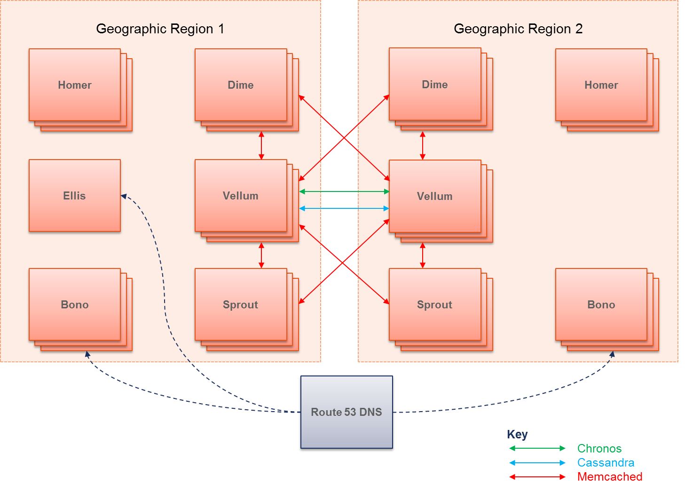

Geographic redundancy
=====================

This article describes

-  the architecture of a geographically-redundant system
-  the (current) limitations
-  the probable impact on a subscriber of a failure
-  how to set it up.

Architecture
------------

The architecture of a geographically-redundant system is as follows.

   Diagram
Sprout has one memcached cluster per geographic region. Although
memcached itself does not support the concept of local and remote peers,
Sprout builds this on top - writing to both local and remote clusters
and reading from the local but falling back to the remote. Communication
between the nodes should be secure - for example, if it is going over
the public internet rather than a private connection between
datacenters, it should be encrypted and authenticated with IPsec. Each
Sprout uses Homers and Homesteads in the same region only. Sprout also
has one Chronos cluster per geographic region; these clusters do not
communicate.

Separate instances of Bono in each geographic region front the Sprouts
in that region. Clearwater uses a geo-routing DNS service such as
Amazon's Route 53 to achieve this. A geo-routing DNS service responds to
DNS queries based on latency, so if you're nearer to geographic region
B's instances, you'll be served by them.

Homestead and Homer are each a single cluster split over the geographic
regions. Since they are backed by Cassandra (which is aware of local and
remote peers), they can be smarter about spatial locality. As with
Sprout nodes, communication between the nodes should be secure.

Ellis is not redundant, whether deployed in a single geographic region
or more. It is deployed in one of the geographic regions and a failure
of that region would deny all provisioning function.

Ralf does not support geographic redundancy. Each geographic region has
its own Ralf cluster; Sprout and Bono should only communicate with their
local Ralfs.

While it appears as a single node in our system, Route 53 DNS is
actually a geographically-redundant service provided by Amazon. Route
53's DNS interface has had 100% uptime since it was first turned up in
2010. (Its configuration interface has not, but that is less important.)

The architecture above is for 2 geographic regions - we do not currently
support more regions.

Note that there are other servers involved in a deployment that are not
described above. Specifically,

-  communication back to the repository server is via HTTP. There is a
   single repository server. The repository server is not required in
   normal operation, only for upgrades.

Limitations
-----------

-  The local IP addresses of all nodes in a deployment most be reachable
   from all other nodes - there must not be a NAT between the two GR
   sites. (This currently precludes having the GR sites in different EC2
   regions.)

Impact
------

This section considers the probable impact on a subscriber of a total
outage of a region in a 2-region geographically-redundant deployment. It
assumes that the deployments in both regions have sufficient capacity to
cope with all subscribers (or the deployments scale elastically) - if
this is not true, we will hit overload scenarios, which are much more
complicated.

The subscriber interacts with Clearwater through 3 interfaces, and these
each have a different user experience.

-  SIP to Bono for calls
-  HTTP to Homer for direct call service configuration (not currently
   exposed)
-  HTTP to Ellis for web-UI-based provisioning

For the purposes of the following descriptions, we label the two regions
A and B, and the deployment in region A has failed.

SIP to Bono
~~~~~~~~~~~

If the subscriber was connected to a Bono node in region A, their TCP
connection fails. They then attempt to re-register. If it has been more
than the DNS TTL (proposed to be 30s) since they last connected, DNS
will point to region B, they will re-register and their service will
recover (both for incoming and outgoing calls). If it has been less than
the DNS TTL since they last connected, they will probably wait 5 minutes
before they try to re-register (using the correct DNS entry this time).

If the subscriber was connected to a Bono node in region B, their TCP
connection does not fail, they do not re-register and their service is
unaffected.

Overall, the subscriber's expected incoming or outgoing call service
outage would be as follows.

::

      50% chance of being on a Bono node in region A *
      30s/300s chance of having a stale DNS entry *
      300s re-registration time
    = 5% chance of a 300s outage
    = 15s average outage

Realistically, if 50% of subscribers all re-registered almost
simultaneously (due to their TCP connection dropping and their DNS being
timed out), it's unlikely that Bono would be able to keep up.

Also, depending on the failure mode of the nodes in region A, it's
possible that the TCP connection failure would be silent and the clients
would not notice until they next re-REGISTERed. In this case, all
clients connected to Bonos in region A would take an average of 150s to
notice the failure. This equates to a 50% chance of a 150s outage, or an
average outage of 75s.

HTTP to Homer
~~~~~~~~~~~~~

(This function is not currently exposed.)

If the subscriber was using a Homer node in region A, their requests
would fail until their DNS timed out. If the subscriber was using a
Homer node in region B, they would see no failures.

Given the proposed DNS TTL of 30s, 50% of subscribers (those in region
A) would see an average of 15s of failures. On average, a subscriber
would see 7.5s of failures.

HTTP to Ellis
~~~~~~~~~~~~~

Ellis is not geographically redundant. If Ellis was deployed in region
A, all service would fail until region A was recovered. If Ellis was
deployed in region B, there would be no outage.

Setup
-----

The process for setting up a geographically-redundant deployment is as
follows.

1. Create independent deployments for each of the regions, with separate
   DNS entries. See `the manual install
   instructions <Manual_Install.md>`__ for the required GR settings.
2. Set up DNS (probably using SRV records) so that:

   -  Bono nodes prefer the Sprout node local to them, but will fail
      over to the one in the other site.
   -  Sprout nodes only use the Homer, Homestead and Ralf nodes in their
      local site.
   -  The Ellis node ony uses the Homer and Homesteads in its local
      site.

3. Configure Route 53 to forward requests for Bono according to latency.
   To do this, for each region, create one record set, as follows.

   -  Name: <shared (non-geographically-redundant) DNS name>
   -  Type: "A - IPv4 address" or "AAAA - IPv6 address"
   -  Alias: No
   -  TTL (Seconds): 30 (or as low as you can go - in a failure
      scenario, we need to go back to DNS ASAP)
   -  Value: <list of IPv4 or IPv6 addresses for this region>
   -  Routing Policy: **Latency**
   -  Region: <AWS region matching geographic region>
   -  Set ID: <make up a unique name, e.g. gr-bono-us-east-1>

You can also use Chef to try GR function, by setting ``"gr" => true`` in
the environment, as described in `the automated install
docs <Automated_Install.md>`__.
