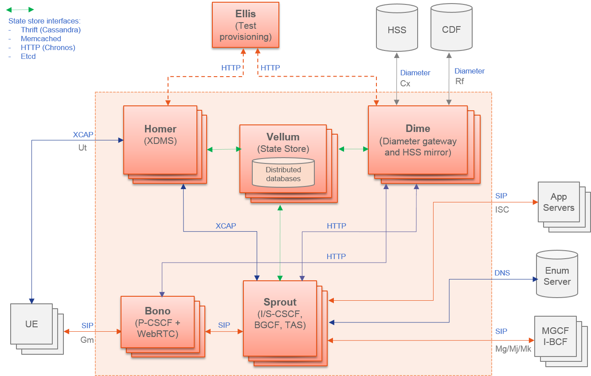

# Clearwater Architecture

Clearwater was designed from the ground up to be optimized for deployment in virtualized and cloud environments.  It leans heavily on established design patterns for building and deploying massively scalable web applications, adapting these design patterns to fit the constraints of SIP and IMS.  The Clearwater architecture therefore has some similarities to the traditional IMS architecture but is not identical.

In particular ...

- All components are horizontally scalable using simple, stateless load-balancing.
- All long lived state is stored on dedicated "Vellum" nodes which make use of cloud-optimized storage technologies such as Cassandra.  No long lived state is stored on other production nodes, making it quick and easy to dynamically scale the clusters and minimizing the impact if a node is lost.
- Interfaces between the front-end SIP components and the back-end services use RESTful web services interfaces.
- Interfaces between the various components use connection pooling with statistical recycling of connections to ensure load is spread evenly as nodes are added and removed from each layer.

The following diagram illustrates the Clearwater architecture and its components.

### Bono (Edge Proxy)

The Bono nodes form a horizontally scalable SIP edge proxy providing both a SIP IMS Gm compliant interface and a WebRTC interface to clients.  Client connections are load balanced across the nodes.  The Bono node provides the anchor point for the client's connection to the Clearwater system, including support for various NAT traversal mechanisms.  A client is therefore anchored to a particular Bono node for the duration of its registration, but can move to another Bono node if the connection or client fails.

Clients can connect to Bono using SIP/UDP or SIP/TCP.  Bono supports any WebRTC client that performs call setup signaling using SIP over WebSocket.

Alternatively, Clearwater can be deployed with a third party P-CSCF or Session Border Controller implementing P-CSCF. In this case Bono nodes are not required.

### Sprout (SIP Router)

The Sprout nodes act as a horizontally scalable, combined SIP registrar and authoritative routing proxy, and handle client authentication and the ISC interface to application servers.  The Sprout nodes also contain the in-built MMTEL application server.  SIP transactions are load balanced across the Sprout cluster, so there is no long-lived association between a client and a particular Sprout node.  Sprout does not store any long-lived data itself and instead uses
- web services interfaces to Homestead and Homer to retrieve HSS configuration such as authentication data/user profiles and MMTEL service settings
- APIs to Vellum for storing subscriber registration data and for running timers.

Sprout is where the bulk of the I-CSCF and S-CSCF function resides, with the remainder provided by Dime (and backed by the long-lived data stores on Vellum).

### Dime (Diameter gateway)

Dime nodes run Clearwater's Homestead and Ralf components.

#### Homestead (HSS Cache)

Homestead provides a web services interface to Sprout for retrieving authentication credentials and user profile information.  It can either master the data (in which case it exposes a web services provisioning interface) or can pull the data from an IMS compliant HSS over the Cx interface.  The Homestead nodes themselves are stateless - the mastered / cached subscriber data is all stored on Vellum (Cassandra for the mastered data, and Astaire/Rogers/Memcached for the cached data).

In the IMS architecture, the HSS mirror function is considered to be part of the I-CSCF and S-CSCF components, so in Clearwater I-CSCF and S-CSCF function is implemented with a combination of Sprout and Dime clusters.

#### Ralf (CTF)

Ralf provides an HTTP API that both Bono and Sprout can use to report billable events that should be passed to the CDF (Charging Data Function) over the Rf billing interface.  Ralf is stateless, using Vellum to maintain the long lived session state and run the timers necessary to enable it to conform to the Rf protocol.

### Vellum (State store)

As described above, Vellum is used to maintain all long-lived state in the dedployment.  It does this by running a number of cloud optimized, distributed storage clusters.
- [Cassandra](http://cassandra.apache.org/).  Cassandra is used by Homestead to store authentication credentials and profile information when an HSS is not in use, and is used by Homer to store MMTEL service settings.  Vellum exposes Cassandra's Thrift API.
- [etcd](https://github.com/coreos/etcd).  etcd is used by Vellum itself to share clustering information between Vellum nodes and by other nodes in the deployment for shared configuration.
- [Chronos](https://github.com/Metaswitch/chronos).  Chronos is a distributed, redundant, reliable timer service developed by Clearwater.  It is used by Sprout and Ralf nodes to enable timers to be run (e.g. for SIP Registration expiry)  without pinning operations to a specific node (one node can set the timer and another act on it when it pops).  Chronos is accessed via an HTTP API.
- [Memcached](https://memcached.org/) / [Astaire and Rogers](https://github.com/Metaswitch/astaire).  Vellum also runs a Memcached cluster fronted by Rogers, with synchronization provided by Astaire.  Astaire is a service developed by Clearwater that enabled more rapid scale up and scale down of memcached clusters. This cluster is used by Sprout for storing registration state, Ralf for storing session state and Homestead for storing cached subscriber data. Rogers is a proxy which sits in front of a cluster of memcached instances to provide replication of data and topology hiding. Astaire and Rogers work together to ensure that all data is duplicated across multiple nodes, to protect against data loss during a memcached instance failuue

### Homer (XDMS)

Homer is a standard XDMS used to store MMTEL service settings documents for each user of the system.  Documents are created, read, updated and deleted using a standard XCAP interface.  As with Homestead, the Homer nodes use Vellum as the data store for all long lived data.

### Ellis

Ellis is a sample provisioning portal providing self sign-up, password management, line management and control of MMTEL service settings.  It is not intended to be a part of production Clearwater deployments (it is not easy to horizontally scale because of the MySQL underpinnings for one thing) but to make the system easy to use out of the box.

### Load Balancing

In a cloud scalable system like Clearwater load balancing is an important part of making the system horizontally scale in a robust way.  Clearwater uses a variation on DNS load balancing to ensure even loading when clusters are being elastically resized to adapt to changes in total load.

As an example, a single domain name is configured for all the Sprout nodes.  Each Bono node maintains a pool of SIP connections to the Sprout nodes, with the target node for each connection selected at random from the list of addresses returned by DNS.  Bono selects a connection at random for each SIP transaction forwarded to Sprout.  The connections in the pool are recycled on failure and periodically, selecting a different address from the list returned by the DNS server each time.

A similar technique is used for the HTTP connections between Sprout and Homer/Dime - each Sprout maintains a pool of connections load balanced across the Homer/Dime clusters and periodically forces these connections to be recycled.

### Reliability and Redundancy

Traditional telco products achieve reliability using low-level data replication, often in a one-to-one design.  This is both complex and costly - and does not adapt well to a virtualized/cloud environment.

The Clearwater approach to reliability is to follow common design patterns for scalable web services - keeping most components stateless and storing long-lived state in specially designed reliable and scalable clustered data stores.

Both Bono and Sprout operate as transaction-stateful rather than dialog-stateful proxies - transaction state is typically short-lived compared to dialog state. As the anchor point for client connections for NAT traversal, the Bono node used remains on the signaling path for the duration of a SIP dialog. Any individual Sprout node is only in the signaling path for the initial transaction, and subsequent requests are routed through the entire Sprout cluster, so failure of a Sprout node does not cause established SIP dialogs to fail. Long-lived SIP state such as registration data and event subscription state is stored in a clustered, redundant shared data store (memcached running as part of Vellum nodes) so is not tied to any individual Sprout node.

Dime and Homer similarly only retain local state for pending requests - all long lived state is stored redundantly in the data store clusters provided by Vellum.

### Cloud Security

SIP communications are divided into a trusted zone (for flows between Sprout nodes, Bono nodes and trusted application servers) and an untrusted zone (for message flows between Bono nodes and external clients or other systems).  These zones use different ports allowing the trusted zone to be isolated using security groups and/or firewall rules, while standard SIP authentication mechanisms are used to protect the untrusted ports.

Other interfaces such as the XCAP and Homestead interfaces use a combination of locked down ports, standard authentication schemes and shared secret API keys for security.
