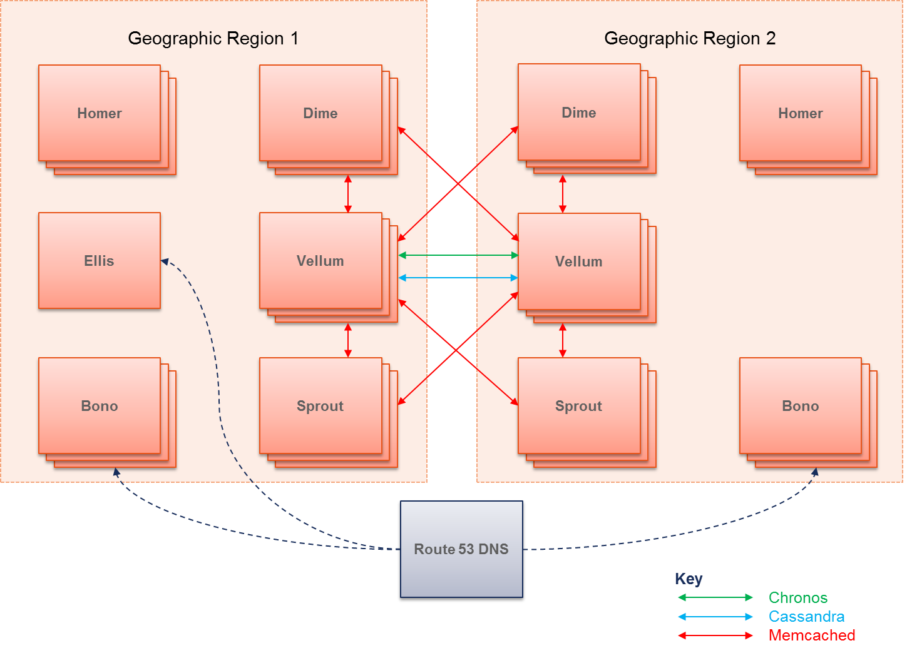

# Geographic redundancy

This article describes the architecture of a geographically-redundant deployment in Clearwater.

Details on how to configure a geographically redundant deployment are available [here](http://clearwater.readthedocs.io/en/latest/Configuring_GR_deployments.html), and how to recover a deployment after site failure is described [here](http://clearwater.readthedocs.io/en/latest/Handling_Site_Failure.html).

## Architecture

The architecture of a geographically-redundant system is as follows.

Each site has its own, separate, etcd cluster. This means that Clearwater's [automatic configuration sharing](Automatic_Clustering_Config_Sharing.md) only applies within a site, not between sites. Data is shared between the sites primarily by Vellum.

Vellum has 3 databases, which support Geographic Redundancy differently:

* The Homestead-Prov, Homer and Memento databases are backed by Cassandra, which is aware of local and remote peers, so these are a single cluster split across the two geographic regions.
* Chronos is aware of local peers and the remote cluster, and handles replicating timers across the two sites itself if configured to be GR. (By default it is configured not to be GR - details [here](https://github.com/Metaswitch/chronos/blob/dev/doc/gr.md).)
* There is one memcached cluster per geographic region. Although memcached itself does not support the concept of local and remote peers, Vellum runs Rogers as a memcached proxy which allows Sprout and Dime nodes to build geographic redundancy on top - writing to both local and remote clusters, and reading from the local but falling back to the remote.

Sprout nodes use the local Vellum cluster for Chronos and both local and remote Vellum clusters for memcached (via Rogers). If the Sprout node includes Memento, then it also uses the local Vellum cluster for Cassandra.
Dime nodes use the local Vellum cluster for Chronos and both local and remote Vellum clusters for memcached (via Rogers). If Homestead-Prov is in use, then it also uses the local Vellum cluster for Cassandra.

Communications between nodes in different sites should be secure - for example, if it is going over the public internet rather than a private connection between datacenters, it should be encrypted and authenticated with (something like) IPsec.

Ellis is not redundant, whether deployed in a single geographic region or more. It is deployed in one of the geographic regions and a failure of that region would deny all provisioning function

Separate instances of Bono in each geographic region front the Sprouts in that region. The Bonos should be able to contact the Sprouts in either region.

The architecture above is for 2 geographic regions - Project Clearwater does not currently support more regions.

Note that there are other servers involved in a deployment that are not described above. Specifically,

* Communication back to the repository server is via HTTP. There is a single repository server. The repository server is not required in normal operation, only for upgrades.

## Limitations

The local IP addresses of all nodes in a deployment most be reachable from all other nodes - there must not be a NAT between the two GR sites. (This currently precludes having the GR sites in different EC2 regions.)
